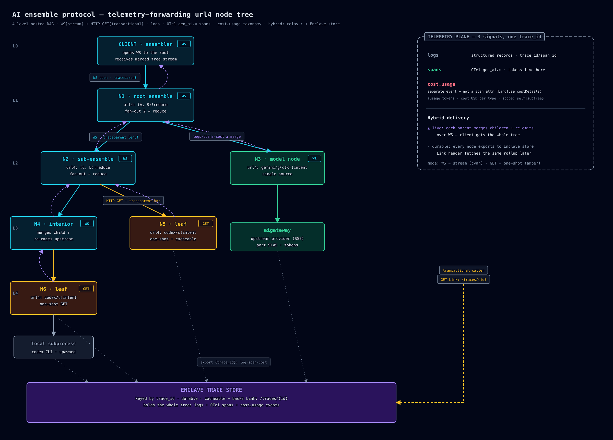
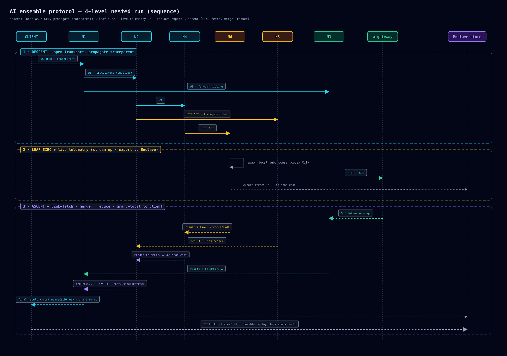

# url4 Engine — Ensemble Execution & Telemetry Doctrine

**Announce at start:** "Using the url4-engine skill — design-stage doctrine for the url4
ensemble execution protocol."

> **STATUS — PROPOSED / DESIGN-STAGE. NOT ratified, NOT built.** The url4 engine is
> legacy-tag-only (`legacy-monorepo-2026-07-08`, plugin `url4_executor`) and revives as
> `packages/url4-python-sdk`. The invariants below are the **agreed mental model**, not
> enforced law — there is no spec or work item yet. Treat each as a design default to apply
> and defend, and STOP-and-ask before hardening any of them into code. One fork is still
> **OPEN** (see F4). Kevin owns the url4 grammar/AST; this skill owns the *execution &
> telemetry* architecture around it.

This doctrine is the CLAUDE.md hexagonal mandate applied to a *recursive network of
processes*: the url4 grammar/AST/resolver is a **port** (the SDK); the engine wires backends
via a registry and **never imports them directly**; and every node is a small process
addressed by a url4 expression. `apps/aigateway` (LiteLLM-based, port 9105, SSE) is the
upstream-provider boundary a leaf node calls; it is not itself a url4 node.

## The mental model (two diagrams)





Rendered diagrams (SVG source + PNG): `docs/diagrams/ensemble-node-architecture.*` (the node
tree + telemetry planes) and `docs/diagrams/ensemble-node-sequence.*` (one nested run:
descent → leaf exec → live telemetry up + Enclave export → ascent/reduce). The canonical
4-level example both diagrams share:

```
L0  CLIENT (ensembler) ── opens WS ──▶ N1
L1  N1  root ensemble      [WS]   url4: (A, B)!reduce          fan-out → reduce
      ├─ L2  N2  sub-ensemble  [WS]   url4: (C, D)!reduce
      │       ├─ L3  N4  interior   [WS]
      │       │        └─ L4  N6  leaf  [HTTP GET] ── spawns local subprocess
      │       └─ L3  N5  leaf  [HTTP GET · cacheable]  + Link header
      └─ L2  N3  model node   [WS] ──▶ aigateway (upstream provider, SSE)
```

## Node model (N)

- **N1 — The url4 expression IS the address.** A node is reached over HTTP with its url4
  expression (`[name:weight:]path(context)!<intent>`) as the address. Because the address
  fully determines the work, a transactional call is an idempotent, cacheable `GET` (the
  "Enclave" cache). *This is why GET — not POST — is the transactional verb.*
- **N2 — The node self-selects transport by role** (see T). Interior / long-running nodes
  stream over WebSocket; a DAG **leaf** may answer one-shot `GET`. Nothing outside the node
  dictates its mode.
- **N3 — Nodes are recursive; execution is a DAG.** An `intent` may itself be a relative
  url4 URL the engine resolves in-process, so a node fans out to child url4 nodes. The
  ensemble shape is **fan-out N backend-calls → reduce** (`(a,b,c)!reduce`, `!*` broadcast,
  `*source(body)!intent` collection-iteration). Bounded concurrency guards the
  collection-fan-out failure mode (see `aigateway/core/concurrency.py`).
- **N4 — A leaf may spawn local subprocesses** (e.g. a coding CLI). Subprocess stdio is
  telemetry like any other signal (O2) and forwards upstream (F).
- **N5 — Core never imports backends.** Grammar/AST/resolver live in `packages/url4-python-sdk`
  (a port); backend routes (`/claude`, `/codex`, `/gemini`) register as adapters; wiring is
  registry-driven. *Same hexagonal law as the rest of the monorepo.*

## Transport & modes (T)

- **T1 — WebSocket = streaming.** During execution the node emits **live events** —
  log records, OTel spans, and `cost.usage` events (O2) — over the socket as they happen.
  Used when a caller needs progress or the run is long-lived.
- **T2 — HTTP GET = transactional.** The node returns the final result synchronously and
  attaches an **RFC 8288 `Link`** header (and/or `202 Accepted` + `Location`) pointing at the
  results/trace URL, so the caller can fetch the *same* telemetry later (F3). *Generalizes the
  existing `X-AIGW-Cache` out-of-band-header convention in aigateway.*
- **T3 — Either edge may be either mode.** Client→node and node→node edges independently
  choose WS or GET. In **all** cases the three signals forward upstream (F) — mode changes the
  *delivery channel*, never *whether* telemetry propagates.

## Observability — three signals, one trace (O)

- **O1 — One `trace_id` spans the whole tree.** Each node is a child span; the tree shares
  one W3C trace. A node links to its parent via the incoming `traceparent` span-id.
- **O2 — Three distinct signals, deliberately separate:**
  1. **logs** — structured records tagged `trace_id`/`span_id`.
  2. **spans** — OTel GenAI semantic conventions (`gen_ai.operation.name`,
     `gen_ai.provider.name`, `gen_ai.request/response.model`,
     `gen_ai.usage.input_tokens`/`output_tokens`). **Token counts live here.** Opt in with
     `OTEL_SEMCONV_STABILITY_OPT_IN=gen_ai_latest_experimental`.
  3. **`cost.usage`** — a **separate taxonomy event, NOT a span attribute.** *OTel keeps cost
     out of the span standard on purpose (cost is derived downstream from tokens × pricing);
     modeling it as its own event is the industry pattern (Langfuse `costDetails`).*
- **O3 — `cost.usage` schema + roll-up.** `{ trace_id, span_id, parent_span_id, node,
  provider, model, pricing_version, usage:{input_tokens, output_tokens, cache_read,
  cache_creation, reasoning}, cost:{…USD per type, total}, scope: "self"|"subtree" }`. Each
  parent emits its own `self` event **and** a `subtree` event = self + Σ(children.subtree).
  *The client sees per-node cost and one grand total.*
- **O4 — Context propagation is explicit per hop.** HTTP hops inject/extract
  `traceparent`/`tracestate` headers; WS hops bind the trace on the **handshake** and carry
  `traceparent` inside each **message envelope**. Never open a span per raw WS frame — span
  logical operations, sample the rest.

## Forwarding topology — HYBRID (F)

- **F1 — Live relay ↑.** Each non-leaf node **merges its children's telemetry with its own
  and re-emits upstream** over its own WS. The client's single stream to the root is the whole
  merged tree — the real-time *view*.
- **F2 — Durable export.** Every node **also** exports its signals to the shared **Enclave
  trace store** (keyed by `trace_id`, cacheable) — the *record of truth*. Relay is fast but
  lossy (a crashed mid-tree node drops its subtree's live events); the store reconciles.
- **F3 — The `Link` header resolves into the Enclave store.** A transactional (GET) caller
  reads the durable record via `Link: /traces/{id}` (T2) instead of the live view.
- **F4 — OPEN DECISION — GET-leaf telemetry return.** Does a one-shot `GET` leaf (no open WS
  to relay on) return its telemetry batch **in the HTTP response body** to its caller, **or
  only** via the Enclave store + `Link` header? The diagrams currently assume **store-side
  only**. *Unresolved — do not encode either behavior as final; confirm with the owner before
  it reaches a spec.*

## Red flags — STOP

| Thought | Action |
|---|---|
| "Make the transactional call a POST." | STOP (N1). url4-expression-as-address ⇒ idempotent GET. |
| "The interior node calls the model backend directly." | STOP (N5). Backends are registry adapters; core never imports them. |
| "Put the dollar cost as a span attribute." | STOP (O2/O3). Cost is a *separate* `cost.usage` event; only tokens go on spans. |
| "Open a span per WS frame." | STOP (O4). Span logical operations, not frames. |
| "The child dumps telemetry only to the collector; parent reads it there." | STOP (F1). Live path is per-hop relay; the store is the *durable* second path, not the only one. |
| "A leaf can skip forwarding — it's a leaf." | STOP (T3). Every mode forwards all three signals upstream. |
| "Point the `Link` header at the node's own ephemeral buffer." | STOP (F3). It resolves into the durable Enclave store. |
| "Just decide the GET-leaf return shape and ship it." | STOP (F4). That fork is OPEN — ask the owner. |
