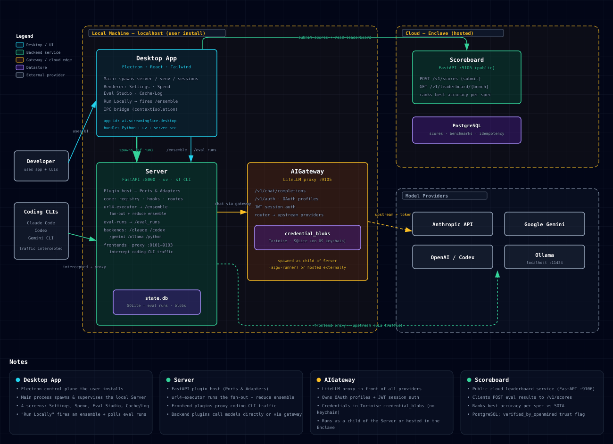
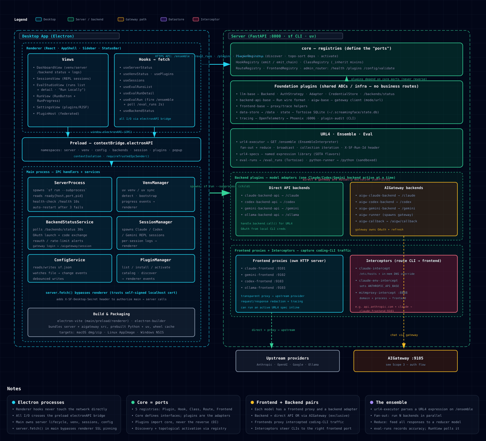
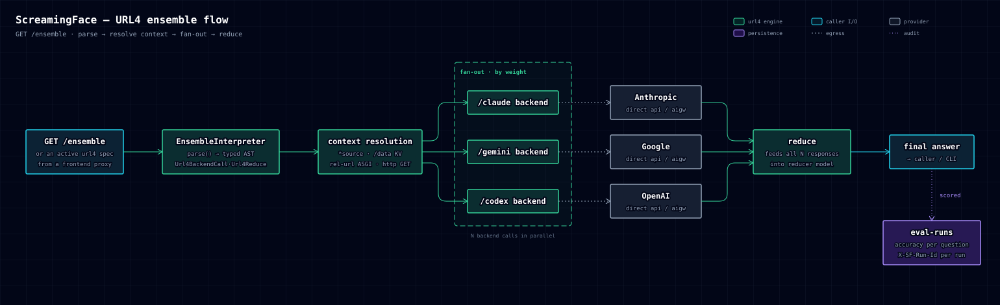
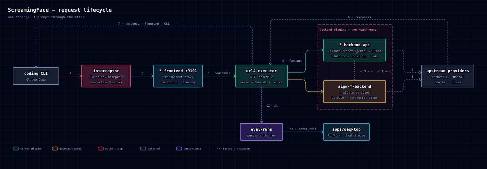
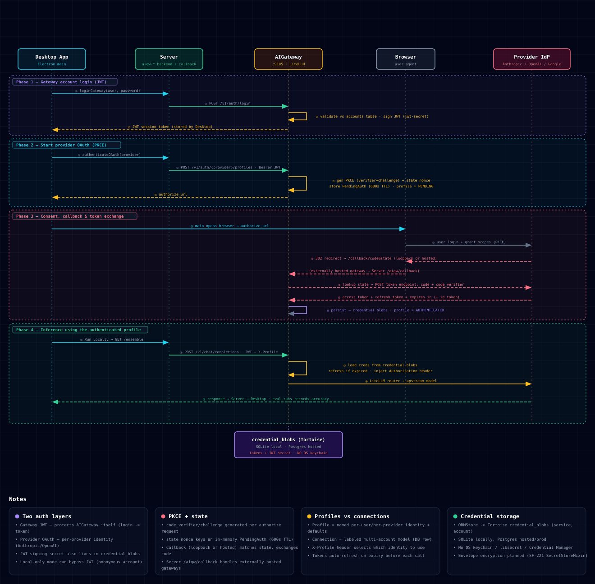

# ScreamingFace — Architecture

> One entry point for understanding the system. For setup see [`SETUP.md`](SETUP.md),
> for vocabulary see [`GLOSSARY.md`](GLOSSARY.md), and for the plugin dependency/conflict
> graph see [`architecture/plugin-dependencies.md`](architecture/plugin-dependencies.md).

## What it is

ScreamingFace is an **AI ensemble for coding-CLI prompts**. Instead of sending your prompt to one
model, it fans the prompt out across several models (Claude, Codex/OpenAI, Gemini, Ollama), then
reduces their answers into one — aiming to beat any single model on coding benchmarks.

The defining property: **it is a self-hosted harness, not a hosted model.** You run it on your own
machine, it sits *between* your existing coding CLIs and the providers (transparent proxy), and it
uses **your own provider credentials** (OAuth from your Claude Code / Codex / Gemini sessions). The
ensemble logic is **programmable** — a small DAG grammar called **URL4** that you author — rather
than a fixed pipeline or a trained router.

## System overview

Four apps in one monorepo, split across a local-machine trust boundary and an optional hosted
enclave.

| App | Path | Role | Tech Stack |
|-----|------|------|-------|
| **Server** | `apps/server` | Plugin-based FastAPI orchestration core. Runs the URL4 engine, intercepts/proxies coding-CLI traffic, dispatches to backends, persists eval runs. The heart of the ensemble. | Python 3.12, FastAPI, Uvicorn, mitmproxy, TatSu, Tortoise ORM, `uv` |
| **AIGateway** | `apps/aigateway` | LiteLLM-based unified gateway. OpenAI-shaped `/v1/chat/completions`; owns provider OAuth, encrypted credential storage, profiles, JWT auth. Runs standalone or is spawned by the Server. | Python 3.12, FastAPI, LiteLLM, Tortoise ORM, SQLite/Postgres, PyJWT |
| **Desktop** | `apps/desktop` | Electron control plane. Bootstraps + supervises the local Python Server, hosts the React dashboard (Settings, Spend, Eval Studio, Logs). | TypeScript, Electron, React, Vite, Tailwind, shadcn/ui |
| **Scoreboard** | `apps/scoreboard` | Public benchmark leaderboard service: submit scores, read leaderboard. | Python 3.12, FastAPI, Tortoise ORM, SQLite/Postgres |

**Trust boundary.** Everything in the dashed *Local machine* frame runs on `localhost` under the
user's install. Only the Scoreboard is hosted. Critically, provider credentials never leave the
local machine — there is **no OS keychain**; tokens live in a local Tortoise `credential_blob` table.

## The Server: a plugin host

The Server is an [Odoo](https://www.odoo.com)-inspired plugin host. Every plugin subclasses
`screamingface.plugin.Plugin`, implements `setup()`, and declares `depends`, `conflicts`,
`backend_call_paths`, and a `settings_class`. The single config file `apps/server/sf.json` enables/
disables plugins and is read by **both** the Server and the Desktop app.

Three extension registries form the "ports" that plugins (the "adapters") plug into:

- **HookRegistry** — priority signal/event bus (`run.started`, `question.checked`, …).
- **ClassRegistry** — Odoo-style `_inherit` mixins resolved into final classes.
- **RouteRegistry** — dynamic FastAPI router add/remove.

Plugins are grouped into families that share base classes:

- **Foundation / infra** (no product behavior alone): `llm-base` (CoreMessage, Backend, AuthStrategy,
  Adapter, CredentialStore), `frontend-base`, `backend-api-base`, `aigw-base`, `state`
  (Tortoise/SQLite lifecycle), `data-store` (`/data` KV for URL4 context), `tracing`
  (OpenTelemetry + Phoenix).
- **URL4 engine**: `url4-executor` (parse / resolve / dispatch) + `url4-specs` (named expression library).
- **Provider plugins** — per provider: a transparent **frontend proxy** + a **backend** (direct-API
  or gateway-routed; the two backends for a provider are mutually exclusive).
- **Interception**: `claude-intercept` / `claude-env-intercept` / `mitmproxy-intercept` (at most one active).
- **Execution / eval**: `python-runner` (sandboxed scripts), `eval-runs` (persists benchmark runs),
  `aigw-runner` (spawns the gateway subprocess), `aigw-callback` (hosted-gateway OAuth bridge).

The plugin **dependency and conflict graph**, plus an analysis of which components are truly
standalone, lives in [`architecture/plugin-dependencies.md`](architecture/plugin-dependencies.md).

## URL4: the ensemble engine

URL4 is the core innovation — a **recursive context-resolution protocol** parsed by a TatSu PEG
grammar. A URL4 expression is a small program that resolves context and dispatches model calls. The
`/ensemble` endpoint parses it into a typed AST, **fans out** the backend calls in parallel (weighted),
then **reduces** all responses into a final answer.

> Example: `(reduce)/gpt( [claude:1:]/claude(*ctx)!"solve", [gemini:1:]/gemini(*ctx)!"solve" )`
> — run the `claude` and `gemini` backends in parallel on shared context `*ctx`, then reduce with `gpt`.

A context value is one of:

| Form | Meaning |
|------|---------|
| `"text"` | plain string, returned as-is |
| `https://…` | absolute URL, fetched via HTTP GET |
| `/path` | relative URL, fetched **in-process via ASGI** (e.g. `/data`, another plugin route) |
| `(a, b, c)` | parenthesized list |
| `[name:weight:]/path(context)!intent` | a **backend call** — dispatch `context` to backend `/path` with an `intent`, tagged `name` and `weight` |
| `*source` | expand a named source |
| `(reduce)/model( … )` | feed the list of results into a reducer model |

So an ensemble query like
`(reduce)/gpt( [claude:1:]/claude(*ctx)!"solve", [gemini:1:]/gemini(*ctx)!"solve" )`
means: run the `claude` and `gemini` backends in parallel on the shared context `*ctx`, then reduce
both answers with the `gpt` model. The `EnsembleInterpreter` recognizes the fan-out shape and falls
back to the base interpreter for non-ensemble expressions. Every run carries an `X-SF-Run-Id` header
so `eval-runs` and tracing can correlate the whole tree.

URL4 writing an ensemble as a readable URL: `(reduce)/gpt( [claude:1:]/claude(*ctx)!"solve", [gemini:1:]/gemini(*ctx)!"solve" )`. One expression contains weights, intent, named sources, and the reducer. 

URL4 is built upon these well-established building blocks

| Piece | Where it comes from |
|-------|---------------------|
| **PEG grammars** | Parsing Expression Grammars, Bryan Ford (2004). A standard way to define a parser. |
| **TatSu** | An existing Python library that turns a PEG grammar into a parser. We just use it as a dependency. |
| **Fan-out then reduce** | The classic "scatter-gather" / map-reduce pattern: run N workers in parallel, merge their results. In the LLM world this is the well-known "ask several models, then have one model combine the answers" trick (mixture-of-agents, self-consistency). |
| **An LLM call-graph written as a small expression** | Same idea as LangChain's LCEL and DSPy — describe a chain/graph of model calls as composable code. |
| **Putting a program *inside* a URL-like string** | `data:` URLs (RFC 2397), JSONPath, and `jq` all encode "a thing to compute" as a compact string. |

## Request lifecycle

How one prompt from a coding CLI travels through the stack:

1. The **coding CLI** (e.g. Claude Code) makes its normal outbound API call.
2. An **interceptor** (`claude-intercept` / `claude-env-intercept` / `mitmproxy-intercept`, one active)
   redirects that traffic to a local frontend proxy.
3. The **frontend proxy** (`claude-frontend :9101`, etc.) transparently forwards to the upstream
   provider, applying redaction + tracing — and can run an active URL4 spec inline.
4. The **url4-executor** (`GET /ensemble`) parses the expression and fans out to **backend plugins**.
5. Each backend reaches its provider either **directly** (OAuth from local CLI creds) or **via the
   AIGateway** (`:9105`). The two backends for a provider are mutually exclusive.
6. Responses are **reduced** in the executor; the answer returns along the reverse path to the CLI.
7. `eval-runs` persists the run; the Desktop **RunView / Eval Studio** polls `/eval_runs`.

## Auth & credentials

There are **two independent auth layers**, both detailed in the sequence diagram below:

- **Gateway JWT** — protects the AIGateway itself (login → signed JWT session).
- **Provider OAuth (PKCE)** — a per-provider identity (Anthropic / OpenAI / Google), used to call
  upstream models on your behalf.

Credentials persist via **`ORMStore` → Tortoise** in a `credential_blob` table (SQLite locally,
Postgres in prod) — **no OS keychain / libsecret / Credential Manager**. Tokens auto-refresh ~60s
before expiry. *Profiles* are named per-user/per-provider identities; the `X-Profile` header selects
which identity a request uses.

## Reference

### Ports

| Port | Service |
|------|---------|
| `:8000` | Server (FastAPI, `sf` CLI) |
| `:9101` / `:9102` / `:9103` / `:9104` | frontend proxies — claude / codex / gemini / ollama |
| `:9105` | AIGateway (LiteLLM) |
| `:9106` | Scoreboard (public) |
| `:11434` | Ollama (upstream, local) |
| `:6006` | Phoenix tracing UI (when `tracing` enabled) |

### Data stores

| Store | Backend | Holds |
|-------|---------|-------|
| `state.db` | SQLite (Tortoise) | eval runs, KV context (`data-store`) |
| `credential_blob` | SQLite local / Postgres prod (Tortoise) | OAuth tokens, JWT secret — no keychain |
| Scoreboard DB | SQLite / Postgres | scores, benchmarks, idempotency |

### Standalone-ability

`apps/aigateway` and `apps/desktop` are **fully standalone** (own projects, HTTP-only coupling to the
rest). `apps/server` is one `uv` project holding all plugins. See
[`architecture/plugin-dependencies.md`](architecture/plugin-dependencies.md) for the full breakdown.

## Diagram sources

All reference diagrams are checked in as **SVG** (embedded above) with a **PNG** export alongside.
The **URL4 ensemble flow** and **request trace** are authored with the blueprint diagramming skill —
each has an interactive `.html` source with an export toolbar (open it in a browser for PNG / PDF
export and hover highlights). The **system overview / Server breakdown / auth flow** are hand-laid
Excalidraw exports.

| Diagram | Canonical source | Exports |
|---------|------------------|---------|
| System overview / Server breakdown / Auth flow | Excalidraw | `architecture/screamingface-*-architecture.svg` + `.png` |
| URL4 ensemble flow | [`…-url4-ensemble-flow-architecture.html`](architecture/screamingface-url4-ensemble-flow-architecture.html) | `.svg` + `.png` |
| Request trace | [`…-request-trace-architecture.html`](architecture/screamingface-request-trace-architecture.html) | `.svg` + `.png` |
| Plugin dependency graph | Mermaid — [`architecture/plugin-dependencies.md`](architecture/plugin-dependencies.md) | — |

> When editing the URL4 flow or request trace, edit the `.html` source (the inline `<svg>` is the
> drawing) and re-export the sibling `.svg` / `.png` — the `.html` is the source of truth.
