# ScreamingFace plugin dependency graph

Generated 2026-05-01 from the `depends`, `conflicts`, and `tags` declarations
in every `apps/server/src/screamingface/plugins/*/plugin.py`. Plus the
`apps/aigateway/` standalone service.

## Mermaid graph (renders on GitHub)

```mermaid
graph TD
    %% ── Independent foundations (no deps) ─────────────────────────────
    subgraph SYS["🟢 System foundations (no deps — standalone)"]
        tracing["tracing<br/><i>OTel + Phoenix</i>"]
        data_store["data-store<br/><i>blob store</i>"]
        url4_specs["url4-specs"]
        url4_executor["url4-executor"]
        frontend_base["frontend-base<br/><i>abstract</i>"]
        backend_api_base["backend-api-base<br/><i>abstract</i>"]
        llm_base["llm-base<br/><i>abstract</i>"]
        mitmproxy["🔌 mitmproxy-intercept<br/><i>spawns mitmdump</i>"]
        aigw_runner["🔌 aigw-runner<br/><i>spawns apps/aigateway</i>"]
    end

    %% ── Frontend plugins ──────────────────────────────────────────────
    subgraph FE["Frontend plugins (HTTP listeners)"]
        claude_frontend["claude-frontend<br/><i>:9101</i>"]
        codex_frontend["codex-frontend"]
        gemini_frontend["gemini-frontend"]
        ollama_frontend["ollama-frontend<br/><i>:9104</i>"]
    end

    %% ── Backend-API plugins (legacy direct-to-provider) ───────────────
    subgraph BEAPI["Direct-API backends (legacy)"]
        claude_backend_api["claude-backend-api<br/>/claude"]
        codex_backend_api["codex-backend-api<br/>/codex"]
        gemini_backend_api["gemini-backend-api<br/>/gemini"]
        ollama_backend_api["ollama-backend-api<br/>/ollama"]
    end

    %% ── Gateway-routed backend plugins (new) ──────────────────────────
    subgraph AIGW["Gateway-routed backends (new)"]
        aigw_base["aigw-base<br/><i>abstract</i>"]
        aigw_claude_backend["aigw-claude-backend<br/>/claude"]
    end

    %% ── Intercept plugins ─────────────────────────────────────────────
    subgraph IC["Claude intercept variants (mutex)"]
        claude_intercept["claude-intercept"]
        claude_env_intercept["claude-env-intercept"]
    end

    %% ── External standalone service ───────────────────────────────────
    subgraph EXT["🟢 External standalone services"]
        aigateway["🌐 apps/aigateway<br/><i>FastAPI + LiteLLM</i><br/><i>:9105 — own uv project</i>"]
    end

    %% ── Dependencies (depends-on edges) ───────────────────────────────
    claude_frontend --> url4_specs
    claude_frontend --> url4_executor
    claude_frontend --> frontend_base
    codex_frontend --> url4_specs
    codex_frontend --> url4_executor
    codex_frontend --> frontend_base
    gemini_frontend --> url4_specs
    gemini_frontend --> url4_executor
    gemini_frontend --> frontend_base
    ollama_frontend --> url4_specs
    ollama_frontend --> url4_executor
    ollama_frontend --> frontend_base

    claude_backend_api --> llm_base
    claude_backend_api --> backend_api_base
    codex_backend_api --> llm_base
    codex_backend_api --> backend_api_base
    gemini_backend_api --> llm_base
    gemini_backend_api --> backend_api_base
    ollama_backend_api --> llm_base
    ollama_backend_api --> backend_api_base

    aigw_base --> llm_base
    aigw_base --> backend_api_base
    aigw_claude_backend --> aigw_base
    aigw_claude_backend --> llm_base
    aigw_claude_backend --> backend_api_base

    claude_intercept --> claude_frontend
    claude_env_intercept --> claude_frontend

    %% ── Conflicts (mutex relations) ───────────────────────────────────
    aigw_claude_backend -.-x|conflicts| claude_backend_api
    claude_intercept -.-x|conflicts| claude_env_intercept
    mitmproxy -.-x|conflicts| claude_intercept
    mitmproxy -.-x|conflicts| claude_env_intercept

    %% ── Runtime call edges (gateway path) ─────────────────────────────
    aigw_runner -.->|spawns| aigateway
    aigw_claude_backend ==>|HTTP POST<br/>/v1/chat/completions<br/>X-Profile| aigateway

    classDef standalone fill:#a8e6a3,stroke:#2d6a2a,color:#000
    classDef external fill:#a3d8e6,stroke:#1e5868,color:#000
    classDef abstract fill:#eee,stroke:#999,color:#666,stroke-dasharray: 5 5
    classDef mutex fill:#ffd6d6,stroke:#a33,color:#000

    class tracing,data_store,url4_specs,url4_executor,mitmproxy,aigw_runner standalone
    class aigateway external
    class frontend_base,backend_api_base,llm_base,aigw_base abstract
    class claude_intercept,claude_env_intercept mutex
```



Legend: solid arrow = `depends`, dotted X = `conflicts` (mutex), thick
double arrow = runtime HTTP call, dotted spawn = subprocess managed by
the plugin.

## Independence classification

The codebase has three orthogonal axes of "independence." A plugin can be
independent on one axis and dependent on another.

### 1. Plugin loading independence (does it `depends` on others?)

| Plugin | depends | Loads alone? |
|---|---|---|
| `tracing` | — | ✅ |
| `data-store` | — | ✅ |
| `url4-specs` | — | ✅ |
| `url4-executor` | — | ✅ |
| `frontend-base` | — | ✅ (abstract — useless alone) |
| `backend-api-base` | — | ✅ (abstract — useless alone) |
| `llm-base` | — | ✅ (abstract — useless alone) |
| `mitmproxy-intercept` | — | ✅ |
| `aigw-runner` | — | ✅ |
| `aigw-base` | `llm-base`, `backend-api-base` | ⚠️ needs 2 abstract bases |
| `*-frontend` (4 plugins) | `url4-specs`, `url4-executor`, `frontend-base` | ⚠️ needs the url4 trio |
| `*-backend-api` (4 plugins) | `llm-base`, `backend-api-base` | ⚠️ needs the 2 bases |
| `aigw-claude-backend` | `aigw-base`, `llm-base`, `backend-api-base` | ⚠️ needs the aigw trio |
| `claude-intercept`, `claude-env-intercept` | `claude-frontend` | 🔗 needs the frontend |

### 2. Process independence (does it run as its own OS process?)

These plugins **spawn subprocesses** that live outside the SF server's
own Python interpreter. They're the closest thing to "fully independent
units" inside this monorepo:

| Plugin | Subprocess it owns | Communication |
|---|---|---|
| `aigw-runner` | `apps/aigateway/` (uvicorn + FastAPI + LiteLLM) | HTTP on `localhost:9105` |
| `mitmproxy-intercept` | `mitmdump` (mitmproxy CLI) | network interception via local mode |
| `tracing` | Phoenix UI (when `phoenix_launch=true`) | OTLP HTTP on `localhost:6006` |
| `*-frontend` (4 plugins) | per-session proxy subprocesses | spawned on demand per Claude/Codex/Gemini/Ollama session |

### 3. Repository-level standalone units

These are the components that could be pulled out of this monorepo into
a separate repo with the least surgery:

| Component | Status | Notes |
|---|---|---|
| 🌐 **`apps/aigateway/`** | **fully standalone** | Own uv project, own pyproject.toml, no imports from `apps/server/`. Communicates with the rest of the system only via HTTP. Zero plugin dependencies. The `aigw-runner` plugin is the SF-side adapter, not the gateway itself. |
| `apps/server/` | monolithic | All 22 plugins live in one uv project. Would need to be split per plugin to extract individually. |
| `apps/desktop/` | fully standalone | Electron app. Talks to `apps/server/` and `apps/aigateway/` via HTTP only. |

## Conflict (mutex) groups

Plugins that **cannot** run together. Activating both raises a load-time
error from the plugin registry.

| Group | Members | Reason |
|---|---|---|
| `/claude` URL ownership | `aigw-claude-backend` ⚔ `claude-backend-api` | Both serve the canonical `/claude` url4 backend path. Pick one. |
| Claude intercept strategy | `claude-intercept` ⚔ `claude-env-intercept` ⚔ `mitmproxy-intercept` | Three different ways to intercept Claude Code's outbound traffic. Only one can be active. |

## What truly runs as an independent unit

If you ask "which services here could survive being given their own repo
and CI pipeline tomorrow with zero refactoring," the answer is:

1. **`apps/aigateway/`** — already standalone. Has its own pyproject,
   plugin loader, Pydantic models, OAuth code, and live e2e test suite.
   The whole `aigw-runner` plugin in `apps/server/` exists *because*
   the gateway is a separate process; it just manages the subprocess
   lifecycle.
2. **`apps/desktop/`** — already standalone Electron build. Pure HTTP
   client of the SF stack.
3. **Phoenix UI** — lives inside `tracing` plugin, but is a third-party
   process the plugin merely launches.
4. **`mitmdump`** — lives inside `mitmproxy-intercept` plugin, but is a
   third-party process the plugin merely launches.

Within `apps/server/` itself, every plugin shares the same Python
process and ASGI app. The `*-frontend` plugins spawn per-session
sub-proxies, but those are short-lived helpers, not standalone services.

## How to regenerate this graph

```bash
# Print every plugin's metadata
cd apps/server/src/screamingface/plugins && for d in */; do
  d=${d%/}; pf="$d/plugin.py"; [ -f "$pf" ] || continue
  echo "=== $d ==="
  grep -nE '^\s*(name|tags|depends|conflicts|backend_call_paths)\s*[:=]' "$pf"
done
```
