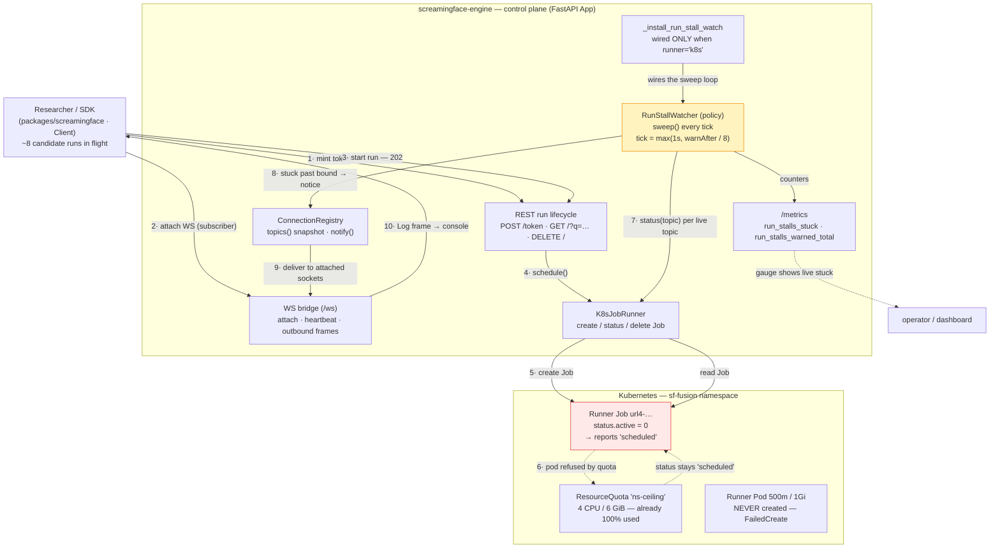
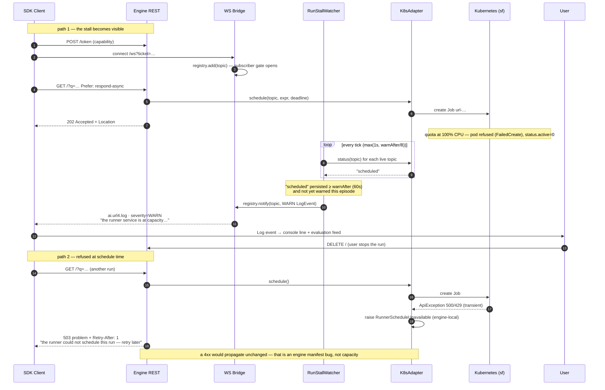
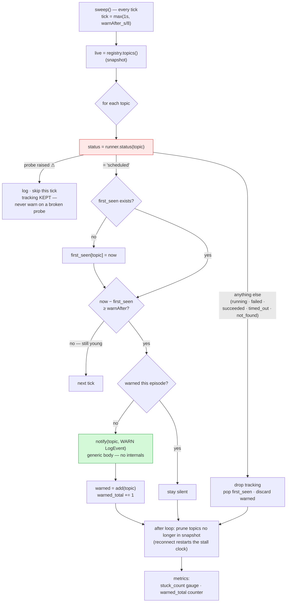

# OME-948 — Run-stall capacity warning: mechanism diagrams

Mermaid views of how the Engine detects a Runner Job that can never start and surfaces a
generic capacity warning to the attached client, plus the schedule-time 503 hardening.

- **Linear:** https://linear.app/openmined/issue/OME-948/surface-a-generic-capacity-warning-when-a-runner-job-cannot-be
- **Spec:** `docs/spec/2026-08-22-OME-948-run-stall-capacity-notice.md`
- **Plan:** `docs/plan/2026-08-22-OME-948-run-stall-capacity-notice.md`

## 1. Component map — where the mechanism lives

**The one-sentence story:** the SDK drives a run; Kubernetes refuses the pod (quota), leaving
the Job stuck at `scheduled`; the RunStallWatcher notices the stall and pushes a generic WARN
through the App's only voice — the notice channel — instead of the client staring at silence
for up to 16 h.

## 2. Sequence — the two paths that matter

## 3. The watcher's decision logic (per sweep, per topic)

**Invariants the diagram encodes:**

- Warn **at most once per stall episode** — a run healed is forgotten instantly (no stale clock).
- A probe failure **costs at most a late warning**, never a crash or a corrupted decision.
- A topic whose client detached is **pruned**, so a reconnect starts a fresh stall clock instead
  of warning instantly against an old one.
- The message is **generic** — symptom-based detection ("scheduled" persisting), never
  cause-based — so the same notice covers quota refusals, node pressure, and any future
  scheduling failure. It carries no internals (no "quota", namespace, or Pod names).

## Accuracy notes

- The notice reaches the client through the SDK's existing `Log` rendering (console line +
  evaluation feed). Rendering *generic* log bodies in the rich TUI panel is the documented
  client-side follow-up and is not shown here.
- The 60 s bound, the `max(1, bound/8)` cadence, and the `"scheduled"` predicate match
  `run_stall.py` / `app.py` verbatim; the knob is `URL4_CLOUD_RUN_STALL_WARN_AFTER_S`
  (chart: `config.runStallWarnAfterS`).
- Advisory-only by design: the watch never stops, reschedules, or otherwise touches a run.
