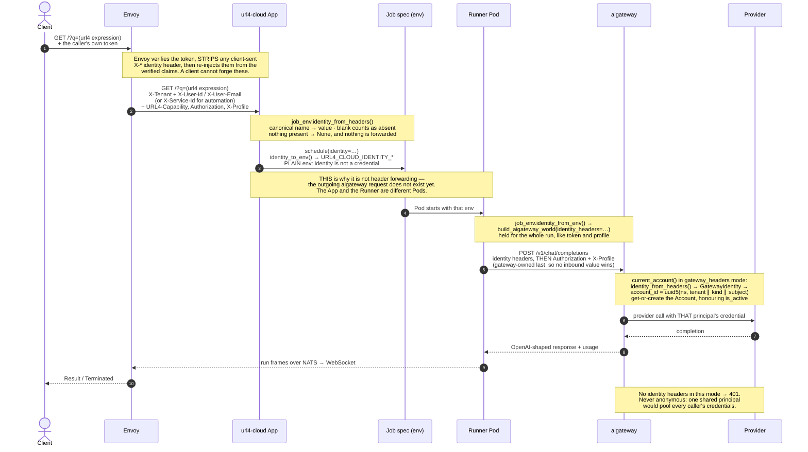
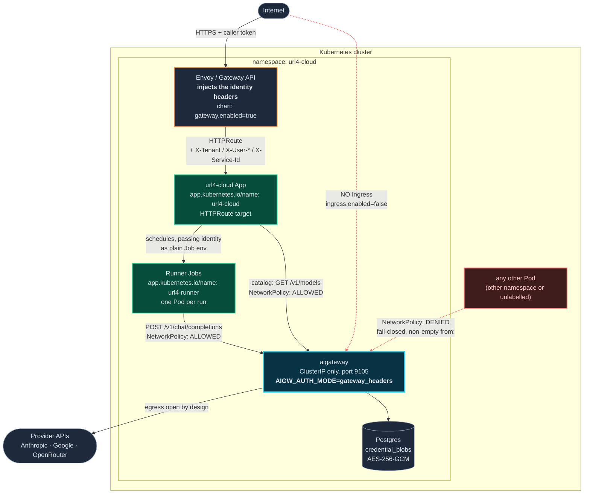
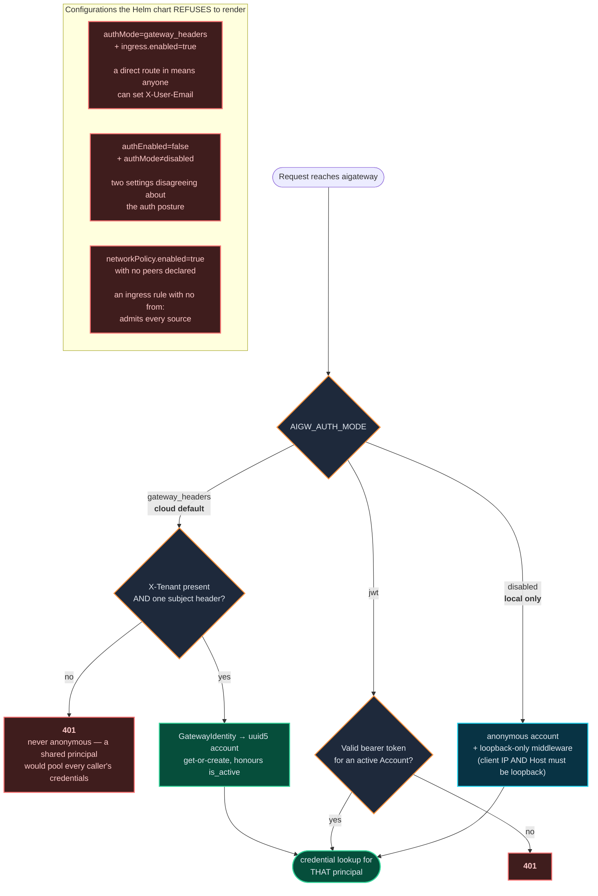

# Gateway identity — how a caller reaches a provider

How the ScreamingFace cloud stack answers "who is calling?". Envoy verifies the caller once at the
edge and re-injects the answer as four plain headers; url4-cloud carries them to each run; aigateway
resolves them to an account and picks that principal's credentials.

Contract: <https://pulse.dev.openmined.org/docs/products/gateway-identity-flow/>

| Header | Source claim | Meaning |
| --- | --- | --- |
| `X-Tenant` | platform route config | Always present. The namespace every subject is scoped under. |
| `X-User-Id` | JWT `sub` | A human. Stable across an address change, so it is the preferred key. |
| `X-User-Email` | JWT `email` | A human. Used as the key only when no `X-User-Id` was issued. |
| `X-Service-Id` | JWT `common_name` | Automation. Its presence *instead of* the user headers is what marks a caller as a service. |

Envoy **clears all four off the inbound request** before re-injecting them, so a client cannot forge
them. That guarantee is what everything below rests on.

The `.mmd` files are the source of truth; the committed `.svg`/`.png` beside them were rendered
with `@mermaid-js/mermaid-cli` (`mmdc -i <file>.mmd -o <file>.svg`, and again with `-s 2` for the
PNG). Re-render after editing one, and keep the inline block below in step with it.

> The SVGs contain `<foreignObject>`, which is what makes `<b>` and wrapped labels work. They render
> in a browser, on GitHub and in any docs site, but a plain SVG rasterizer drops the text — use the
> PNG there.

---

## 1 · Request flow

The one counter-intuitive part: this is **not** header pass-through. The App that receives the
headers and the Runner Pod that calls aigateway are different processes, and the outgoing request
does not exist yet when the headers arrive — so identity is captured, serialized onto the Job spec
as plain env, and re-rendered by the connector.

[`gateway-identity-flow.svg`](gateway-identity-flow.svg) · [PNG](gateway-identity-flow.png)

<!-- source: gateway-identity-flow.mmd -->


**Why the account id is derived, not allocated.** `account_id = uuid5(namespace, tenant ∥ kind ∥
subject)` — the same caller maps to the same id in every process, with no lookup as the source of
truth. `credential_blobs` and `oauth_connections` are keyed on that id, so an unstable id would
orphan every credential the caller has stored. The namespace constant must never change. The email
is deliberately *not* part of the key, so changing address does not lose access.

## 2 · Deployment topology

Trusting `X-User-Email` is only sound while aigateway cannot be reached except by the peers that
carry verified identity. Two chart settings enforce that, and both must hold: no Ingress, and a
fail-closed NetworkPolicy.

[`gateway-identity-topology.svg`](gateway-identity-topology.svg) · [PNG](gateway-identity-topology.png)

<!-- source: gateway-identity-topology.mmd -->


**The NetworkPolicy detail that matters.** Each allowed client is ONE `from` element carrying both
its `namespaceSelector` and its `podSelector`. Selectors inside an element are ANDed; separate
elements are ORed — so splitting them would mean "any pod in that namespace OR that label anywhere",
i.e. the whole namespace. Two entries are needed because the App and the Runner Jobs share no label.

> **Unverified precondition.** A NetworkPolicy only restricts traffic if the cluster's CNI enforces
> it; some do not, and then the object is decoration. Since this policy *is* the authentication
> boundary in `gateway_headers` mode, test it: from a Pod in another namespace,
> `curl -H 'X-User-Email: …' http://<aigw-svc>:9105/v1/chat/completions` must **time out**. If it
> answers, header identity is not safe in that cluster.

## 3 · Auth modes and the refused configurations

[`gateway-identity-auth-modes.svg`](gateway-identity-auth-modes.svg) · [PNG](gateway-identity-auth-modes.png)

<!-- source: gateway-identity-auth-modes.mmd -->


`AIGATEWAY_AUTH_ENABLED` is the legacy spelling: `false` still means `disabled`, and the chart
resolves the pair so only `AIGW_AUTH_MODE` reaches the app.

## Local development

Nothing above is required locally. `url4-cloud serve --local` fuses the App and the runner in one
process, and aigateway runs in `disabled` mode (anonymous, loopback-only) — so a plain `curl` works
with no identity at all. To exercise the identity path locally, send the headers yourself; there is
no Envoy to strip them:

```sh
curl -H 'X-Tenant: openmined' -H 'X-User-Email: me@openmined.org' \
     -H 'URL4-Capability: <token>' 'http://127.0.0.1:8000/?q=...'
```

## Known gap

Nothing yet provisions credentials for a header-derived principal. Each principal gets its own
credential namespace, so a caller with no configured profile reaches aigateway, authenticates, and
then gets `404 profile_not_found` — auth succeeds, the credential lookup does not.
