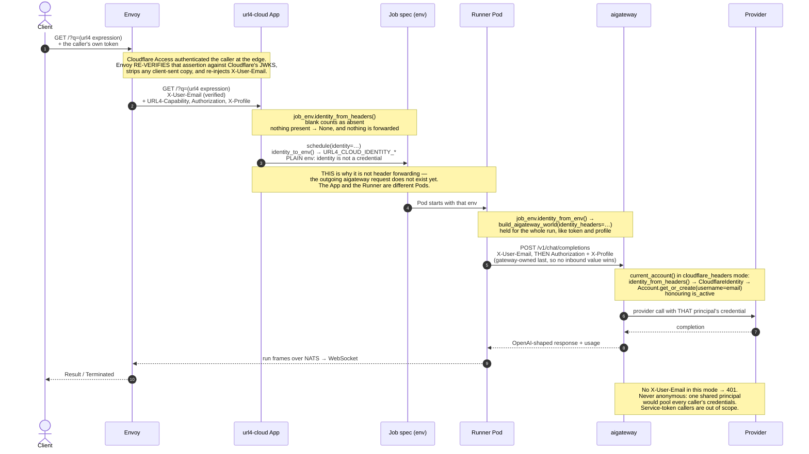
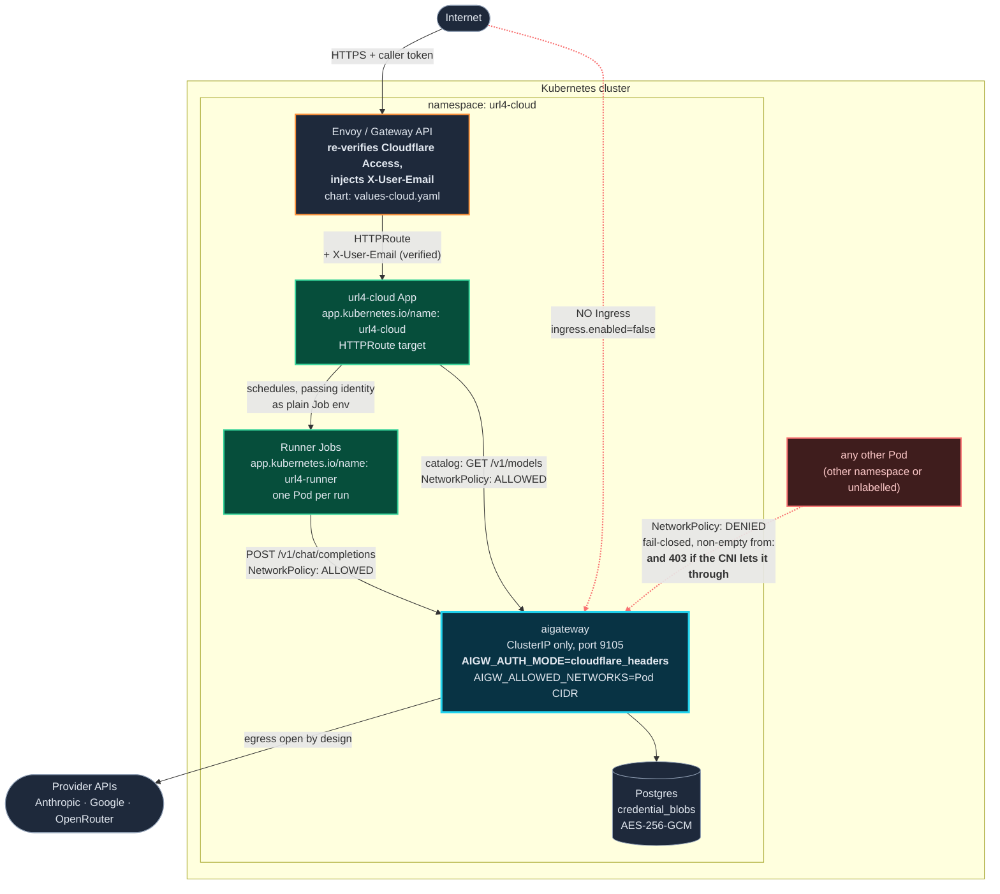
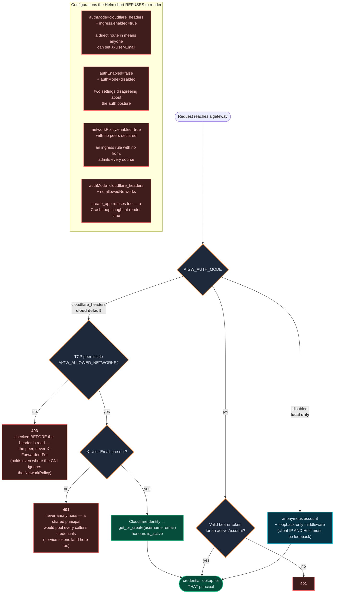

# Gateway identity — how a caller reaches a provider

How the ScreamingFace cloud stack answers "who is calling?". Cloudflare Access authenticates the
caller at the edge; Envoy re-verifies that assertion and re-injects the answer as one plain header;
url4-cloud carries it to each run; aigateway resolves it to an account and picks that principal's
credentials.

Contract: <https://pulse.dev.openmined.org/docs/products/gateway-identity-flow/>

| Header | Source claim | Meaning |
| --- | --- | --- |
| `X-User-Email` | Cloudflare Access JWT `email` | The whole identity. It is the account's `username`, which is unique — so it is the key. |

Envoy **clears it off the inbound request** before re-injecting the verified value, so a client
cannot forge it. That guarantee is what everything below rests on.

The flow also carries a tenant, and a `common_name` for Cloudflare **service tokens**. Both are
deliberately ignored here: an email is globally unique, so a tenant adds nothing to a key built from
it, and automation is out of scope until the gateway issues its own API keys — a service-token caller
gets a 401 rather than being half-identified.

The `.mmd` files are the source of truth; the committed `.svg`/`.png` beside them were rendered
with `@mermaid-js/mermaid-cli` (`mmdc -i <file>.mmd -o <file>.svg`, and again with `-s 2` for the
PNG). Re-render after editing one, and keep the inline block below in step with it.

> The SVGs contain `<foreignObject>`, which is what makes `<b>` and wrapped labels work. They render
> in a browser, on GitHub and in any docs site, but a plain SVG rasterizer drops the text — use the
> PNG there.

---

## 1 · Request flow

The one counter-intuitive part: this is **not** header pass-through. The App that receives the
headers and the Runner Pod that calls aigateway are different processes, and the outgoing request
does not exist yet when the headers arrive — so identity is captured, serialized onto the Job spec
as plain env, and re-rendered by the connector.

[`gateway-identity-flow.svg`](gateway-identity-flow.svg) · [PNG](gateway-identity-flow.png)

<!-- source: gateway-identity-flow.mmd -->


**Why the username is the key.** `Account.username` is already unique, so the identity needs no
second derivation and there is no parallel key to keep in step: the lookup is
`Account.get_or_create(username=email)`. `credential_blobs` and `oauth_connections` hang off the
account's id, which is stable for the row's lifetime — so one caller keeps one account and one set of
credentials. The address is lowercased for the key, because letting `A@x.test` and `a@x.test` become
two accounts would split one person's credentials in two.

`get_or_create` is the framework's own primitive and already handles the race that actually happens
here — two concurrent first requests from one caller, the normal case for an SDK with a connection
pool. Tortoise creates inside a transaction and re-fetches on `IntegrityError`.

## 2 · Deployment topology

Trusting `X-User-Email` is only sound while aigateway cannot be reached except by the peers that
carry verified identity. Three things enforce that, and all must hold: no Ingress, a fail-closed
NetworkPolicy, and — in the gateway process itself — `AIGW_ALLOWED_NETWORKS`.

The third exists because the first two are *deployment* configuration, and one of them can be
declined by the cluster (see the precondition note below). `AIGW_ALLOWED_NETWORKS` is a list of CIDR
networks; a request whose TCP peer falls outside every one of them is refused **403 before the
identity header is read**. It is mandatory in this mode: `create_app` raises without it and the
chart fails the render, because "which networks?" has no answer the gateway can safely guess.

The peer is the TCP peer, never `X-Forwarded-For`. Deciding whether to trust one forgeable header by
reading a second, equally forgeable one would be circular — a deployment behind a proxy declares the
proxy's own address instead.

[`gateway-identity-topology.svg`](gateway-identity-topology.svg) · [PNG](gateway-identity-topology.png)

<!-- source: gateway-identity-topology.mmd -->


**The NetworkPolicy detail that matters.** Each allowed client is ONE `from` element carrying both
its `namespaceSelector` and its `podSelector`. Selectors inside an element are ANDed; separate
elements are ORed — so splitting them would mean "any pod in that namespace OR that label anywhere",
i.e. the whole namespace. Two entries are needed because the App and the Runner Jobs share no label.

> **Unverified precondition.** A NetworkPolicy only restricts traffic if the cluster's CNI enforces
> it; some do not, and then the object is decoration. Test it: from a Pod in another namespace,
> `curl -H 'X-User-Email: …' http://<aigw-svc>:9105/v1/chat/completions` must **time out**.
>
> If it answers, the CNI is not enforcing the policy — but the request still gets **403** from
> `AIGW_ALLOWED_NETWORKS` unless that Pod's address is inside a declared network. That is the point
> of the in-process check: it converts a silent cluster-wide impersonation hole into a refusal.
> Narrow `config.allowedNetworks` from the shipped private ranges to your actual Pod CIDR and the
> two guards stop overlapping so generously.

## 3 · Auth modes and the refused configurations

[`gateway-identity-auth-modes.svg`](gateway-identity-auth-modes.svg) · [PNG](gateway-identity-auth-modes.png)

<!-- source: gateway-identity-auth-modes.mmd -->


`AIGATEWAY_AUTH_ENABLED` is the legacy spelling: `false` still means `disabled`, and the chart
resolves the pair so only `AIGW_AUTH_MODE` reaches the app.

## Local development

Nothing above is required locally. `url4-cloud serve --local` fuses the App and the runner in one
process, and aigateway runs in `disabled` mode (anonymous, loopback-only) — so a plain `curl` works
with no identity at all. To exercise the identity path locally, send the headers yourself; there is
no Envoy to strip them:

```sh
curl -H 'X-User-Email: me@openmined.org' \
     -H 'URL4-Capability: <token>' 'http://127.0.0.1:8000/?q=...'
```

## Known gap

Nothing yet provisions credentials for a header-derived principal. Each principal gets its own
credential namespace, so a caller with no configured profile reaches aigateway, authenticates, and
then gets `404 profile_not_found` — auth succeeds, the credential lookup does not.
