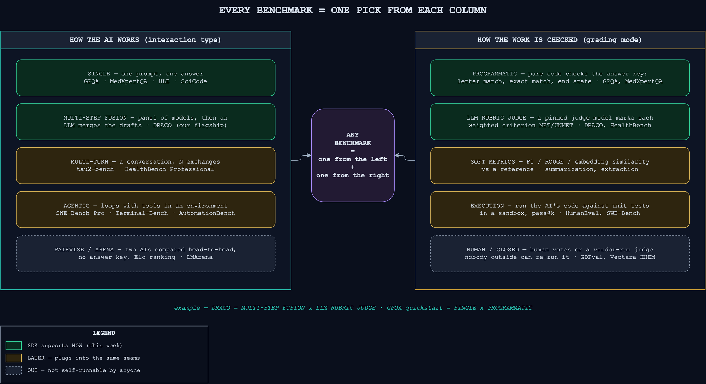
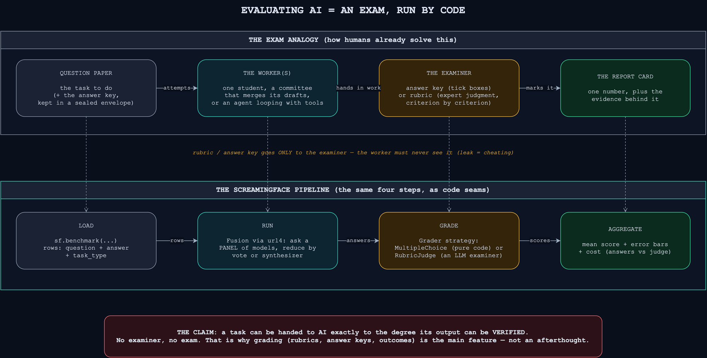

# ScreamingFace Generalized Benchmarking Framework


## 1 · What we want to build

One sentence: **a Python SDK where evaluating any AI setup on any benchmark is four lines
of code — and the grading is the headline feature, not an afterthought.**

ScreamingFace allows devs to get better, cheaper, faster intelligence by
**asking several AIs instead of one** — a panel of models whose answers get merged
(a vote, or a synthesizer LLM), or a router that sends each sub-task to the model best at it. That's the *fusion*. Every fusion is a **url4 recipe** — one URL string that IS the whole setup, shareable in a tweet, reproducible by anyone who pastes it.

A claim like "this fusion beats GPT-5.5" is only worth something if it's **measured, reproducibly, on a benchmark anyone can re-run**. So the SDK's real job is the
measurement machine. Example syntax can be (based on the observation that all benchmarks can be generalized into 4 phases):

```python
import screamingface as sf

bench  = sf.benchmark("data/draco-demo-slice-5.jsonl")                # 1 load
fusion = sf.Fusion("fable_plus_gpt", 
                   models=["fable-5", "gpt-5.5"],
                   reducer=sf.Synthesize("anthropic/claude-opus-4.8")
)
run    = fusion.evaluate(bench, seed=0)                              # 2 run
scores = run.grade(sf.RubricJudge("google/gemini-3.1-pro-preview"))  # 3 grade
scores, run.cost                                                     # 4 aggregate
```

`sf.Fusion(..., reducer=sf.Synthesize(...)) compiles` to `url4` looking something like this:
```
( question='<the prompt>',                                    ← literal, bound to a name
  panel_1=/claude/fable-5($question)!'Answer the question',   ← model call #1
  panel_2=/codex/gpt-5.5($question)!'Answer the question',    ← model call #2
  fusion_answer=/claude/opus-4.8(                             ← the synthesizer call
      'Question:\n$question\n\nPanel 1:\n$panel_1\n\nPanel 2:\n$panel_2'
    )!'Synthesize the panel answers into one final answer'
    ;temperature=0.0;max_tokens=8192,                         ← call params
  {schema: 'screamingface.fusion-result.v1',                  ← result shape
   panel_1_answer: '$panel_1', panel_2_answer: '$panel_2',
   answer: '$fusion_answer'} )
```

---

## 2 · The types of benchmarks



Every benchmark answers two independent questions — **how does the AI work on a row**,
and **how is the work checked**. Pick one from each column and you've described any
benchmark that exists (and, we claim, any that will exist — §3).

### Column A — how the AI works (interaction type)

| Type | What happens | Examples | SDK |
|---|---|---|---|
| **single** | one prompt → one answer | GPQA, MedXpertQA, HLE, SciCode, LegalBench | **now** |
| **multi-step fusion** | panel of models → LLM merges the drafts | **DRACO** (our flagship) | **now** |
| **multi-turn** | a conversation, N exchanges | τ²-bench, HealthBench Professional | later |
| **agentic** | loops with tools in an environment | SWE-Bench Pro, Terminal-Bench, AutomationBench | later |
| **pairwise / arena** | two AIs head-to-head, no key, Elo | LMArena | out (no per-row truth) |

### Column B — how it's checked (grading mode)

| Mode | Mechanism | Examples | SDK |
|---|---|---|---|
| **programmatic** | pure code vs answer key: letter/exact match, end state | GPQA, MedXpertQA, ARC-AGI-2 | **now** |
| **LLM rubric judge** | pinned judge model marks each weighted criterion | **DRACO**, HealthBench Pro | **now** |
| **soft metrics** | F1 / ROUGE / embedding similarity vs reference | summarization, extraction | later |
| **execution** | run the AI's code against unit tests, pass@k | HumanEval, SWE-Bench | later |
| **human / closed** | human votes or vendor-run judge | GDPval, Vectara HHEM | out (nobody can re-run) |

### We need to design the eval framwork based on future targets

- **Fresh/dynamic data** — questions newer than every training cutoff (LiveBench monthly,
  LiveCodeBench weekly, MixEval rotation). DRACO's "grounded deep research" is already this.
- **Private-data benchmarks** — the biggest gains live in data frontier models never saw;
  the benchmark runs where the data lives (`syft://` from SyftSpace)
- **Cost & speed as scores** — "best" is meaningless without "at what price, how fast, on which tasks".
- **Routing benchmarks** — grade the *router*, not a model: did each sub-task go to the
  right model?
- Benchmark types nobody has invented yet — which is why the architecture is seams, not
  features (§3).

---

## 3 · LLM Eval Analogy: An exam


Think of an LLM as **a person / a team trying to do a job / passing an exam**. Maybe one person. Maybe a committee that merges its drafts (a fusion). Maybe someone with many chances, like us - humble humans in real life, who loop — try, uses tools, check, fail, retry (agent(s) in a loop). Whatever the shape of the worker, the world only trusts the result because of what happens next: **an examiner checks the work** — sometimes against a deterministic answer key (tick the box), sometimes with expert judgment against a rubric, criterion by criterion. Then the marks get rolled up into a report card. Below is the figure on how this analogy maps to the framework we are trying to build:


That's every benchmark, in four steps, and each step is a **pluggable seam**:

```
   load            run                    grade                   aggregate
question paper → worker(s) attempt    → examiner marks it     → report card
Benchmark/Row  →  Runner: row→answer  →  Grader: answer→score →  mean + CI + cost
```

Imagine in the future, we want to onboard Aanew kind of benchmark — including ones that don't exist yet — is a new strategy at **one** seam, never a reshape of the pipeline:

- a new *data shape or source* (HF, URLs, private `syft://`) → a new `Loader`
- a new way of *working* (multi-turn, agentic, some 2027 invention) → a new `Runner`
- a new way of *checking* (execution sandbox, soft metrics, a better judge) → a new `Grader`
- a new way of *rolling up* (Elo, pass@k, percentile-vs-board) → a new `Aggregator`

The only things that genuinely don't fit are benchmarks nobody can self-run (closed
judges, human arenas) — an honest boundary, because nobody else can onboard those either.
<!-- 
### The verifiability claim (why grading is THE feature)

> **A task can be handed to AI exactly to the degree its output can be verified.**

This is our working restatement of **Verifier's Law** (Jason Wei, OpenAI/ex-Google Brain,
[*Asymmetry of verification and verifier's rule*](https://www.jasonwei.net/blog/asymmetry-of-verification-and-verifiers-law),
Jul 15 2025): *"The ease of training AI to solve a task is proportional to how verifiable
the task is. All tasks that are possible to solve and easy to verify will be solved by
AI."* Wei's point is about training; ours is the deployment corollary — the same
verifiability that lets a lab train on a task is what lets a user trust, compare, and
delegate it.

The hardest thing about using LLMs for real work is not getting an answer — it's knowing whether the answer is any good. No examiner, no exam: if you can't check the work, you can't delegate the work, you can't compare workers, and you can't claim SOTA. So the first question for "can AI do X?" is always "**how would we grade X?**" — and the SDK must make expressing that grading trivial: drop in an answer key, a weighted rubric, a checkable outcome, and the pipeline does the rest.

And ScreamingFace's twist on the *worker* side is deliberately simple: **we just make it
easy to ask multiple AIs instead of one** — a panel with a merge step, or a router
sending each sub-task to the model best at it — expressed as one url4 recipe. Better
workers (fusions) × trustworthy examiners (graders) = the leaderboard the deck promises.

One safety rule falls straight out of the analogy: **the answer key travels in a sealed
envelope**. The rubric lives in the row's `answer` field; it goes to the examiner ONLY.
A worker who sees the rubric is cheating — that's DRACO's leak rule (panel models with
web search were literally *finding the rubric online*; hence the domain blocklist). -->

---

## 4 · What we have, what's missing, who to learn from


### Have today (`packages/screamingface`)

- `sf.Fusion` + `sf.MajorityVote` + `sf.Synthesize` — compiles to a shareable url4 recipe; synthesis executes inside the engine graph. **The RUN seam mostly exists.**
- Session mock/live modes; local dev url4 engine with deterministic subprocess model
  routes (`url4.dev.toml`) — the whole demo runs keyless.
- The validated DRACO rubric grader that we reproduced the results on many fusions and solo models
- We also have a GPQA MCQ evaluate loop — works, but **hardcoded** to one benchmark shape

### What we need to build (for DRACO and then future benchmarks)

DRACO is abstractive + rubric-judged, so the current hardcoded MCQ path has nothing for it. Only gap 6 is DRACO-specific, and it's pure config — each new benchmark brings its own equivalent (a model lineup, a dataset), never new pipeline code. Other
future benchmark (HealthBench, MedXpertQA, anything in a JSONL) will also need these.

1. `sf.benchmark(path|name)` — generic loader, `Row(id, source, task_type, question, answer, metadata)`, rubric preview.
2. Per-task-type prompting — today the instruction sent to every model is hardcoded to
   `Answer the multiple-choice question`, so a research benchmark would get an MCQ
   prompt. Each `task_type` must bring its own instruction and answer format
   (mcq → "reply with one letter A–D"; abstractive → "write a full research report").
3. `Run.rows` — keep per-row answers (today they're discarded after scoring).
4. `screamingface/grading/`: `MultipleChoice` (fold in existing MCQ logic) + `RubricJudge`
   (vendor the validated grader) + `run.grade()`.
5. `run.cost` — answer vs judge call counts (judge spend dominated the validated run
   $2,699 vs $787; a Run that meters only panel calls under-reports DRACO ~4×).
6. DRACO lineup in the model catalog + mock engine routes (fable-5, openai/gpt-5.5,
   opus-4.8, gemini-3.1-pro-preview).

Beyond the six gaps, four rules keep the numbers trustworthy — in one breath: **a
grading failure never becomes a score · the answer key never reaches the worker · every
published number says exactly who graded it and on what data · every score ships with
error bars and an honest bill.** The precise developer contracts behind these live in
the appendix at the end of this doc.

### Some open-source dynamic evaluation repos we can learn from

| Reference | License | Take |
|---|---|---|
| **[Inspect AI](https://github.com/UKGovernmentBEIS/inspect_ai)** (UK AI Security Institute) | MIT | **Primary architecture reference.** Same four seams, decorator-registered; `Solver(TaskState)` runner scales single-shot → agentic; hardened judge contract; cache keys incl. gen-config. Learn from, don't embed — its executor wants to own model calls, and url4 is our executor. |
| **[inspect_evals](https://github.com/UKGovernmentBEIS/inspect_evals)** | MIT | 100+ real benchmarks written against those seams — the empirical test of "do the seams hold". |
| **[simple-evals](https://github.com/openai/simple-evals) / HealthBench** (OpenAI) | MIT | **Vendor-copy the rubric math**: per-criterion binary judge, denominator = positive points only, clip [0,1], bootstrap CI, "such as/for example" leniency clause. Near-identical to our DRACO grader. |
| **[Arena-Hard-Auto](https://github.com/lmarena/arena-hard-auto)** (LMArena) | Apache-2.0 | Result identity discipline: every published number keyed by {snapshot, judge model, prompt hash, mode}. Also bootstrap CIs + style control (length/markdown bias) for judges. |
| **[promptfoo](https://github.com/promptfoo/promptfoo)** | MIT | Weighted mixing of programmatic + judge graders; the only tool with first-class cost accounting. |
| **[lm-evaluation-harness](https://github.com/EleutherAI/lm-evaluation-harness)** (EleutherAI) | MIT | Filter pipelines (multiple reducers over one set of generations — majority@k). No judge, no agents — don't pattern the core on it. |
| **[MixEval](https://github.com/Psycoy/MixEval)** (NeurIPS 2024) | MIT | Version-pinned dataset discipline + judge prompt patterns. **Cautionary tale**: falls back to *random scores* on unparseable judge output — our graders return explicit `unresolved`, never noise. |
| **[LiveBench](https://github.com/LiveBench/LiveBench)** / **[LiveCodeBench](https://github.com/LiveCodeBench/LiveCodeBench)** | see repo / MIT | Snapshot + date-gating discipline for dynamic benchmarks: per-item dates, release pinning, compare only within a window. |
| **[HELM](https://github.com/stanford-crfm/helm)** / **[lighteval](https://github.com/huggingface/lighteval)** / **[OpenCompass](https://github.com/open-compass/opencompass)** | Apache / MIT / Apache | Spec-vs-state split, prediction caching (re-grade without re-running inference), partitioner⟂runner. Learn-only. |

Industry gap we fill: **nobody does real $ cost accounting** (answer vs judge, billed vs
cached). Our `run.cost` is differentiation, not table stakes. And **nobody** does
private-data federated benchmarks — that's the syft:// moat.

---

## 5 · Lessons from running benchmarks ourselves (DRACO, HealthBench, MedXpertQA)

Before this SDK, we ran these benchmarks for real in our own arena
([screamingface-benchmarks](https://github.com/OpenMined/screamingface-benchmarks)). Some lessons are

### 5.1 Money safety - Cost Upperbound Guard

- **Fail-closed:** a live (non-mock) run with no budget refuses every paid call.
- **Every call gated before the attempt** — retries included, judge calls included
  (judge spend is where the money went: $2,699 judge vs $787 answers).
  rows on rubric benchmarks.
- **Unpriced model + budget set = refuse to launch** (otherwise priced models burn money and the run dies at the first unpriced call).
- Failed attempts and reasoning tokens count against the budget.

→ SDK effect: `evaluate()` / `grade()` take a `budget=`; live mode without one is an
error, not a warning.

### 5.2 Resume, caching, and reusing old runs — first-class, not nice-to-have

The single most-used arena capability in practice. The rules it learned:

- **Pay once, keep forever.** Every answer is written to disk *the moment it is paid
  for, before grading* — a crash in grading loses a row of work, never the money.
- **Resume is identity-keyed.** Re-launching with the same run id skips every completed
  row; forgetting the id silently re-pays everything (the arena's most expensive
  footgun — the SDK must make the run id impossible to lose, not document it).
- **Re-grade and re-aggregate without re-running.** Stored answers can be re-judged
  (new grader, more judge runs) and stored verdicts re-aggregated (new breakdowns) with
  zero panel calls — inference, grading, and aggregation are separately replayable.
- **Cross-run reuse:** panel answers cached from solo runs feed later fusion runs
  (`reuse_panel_answers`) — only the synthesizer and judge are paid again. This is the
  pattern that made the 100-row DRACO validation affordable.
- **Bad caching patterns that should be avoided**: failed/empty answers are never cached; self-consistency panels (same model twice at temp 0) must bypass the cache or one cached answer serves both slots; judge prompts are salted with the answer hash so an upstream provider cache can never serve one answer's verdicts to a different answer.

→ SDK effect: `Run` is a **persistent, resumable artifact** (rows flushed as they land,
run id + completion marker + config snapshot), not an in-memory object; `run.grade()`
and re-aggregation always work from the stored artifact.

### 5.3 Serving everyone else's results — the $0 read path

The leaderboard story only compounds if **consuming a published run costs nothing**:
no LLM calls, no compute, no keys. A published run must therefore be the *whole record*,
not a number:

- per-row answers + per-row judge verdicts + the result identity
  (benchmark snapshot, fusion url4, grader, judge model + version, prompt hash, mode,
  runs) + config and pricing snapshots + cost breakdown.
- Anyone can then load it and **inspect, re-aggregate, slice, and diff locally for
  free** — verify the claim without re-paying for it. Reproduce-from-scratch stays
  available (paste the url4 recipe); it's the *expensive* option, not the only one.
- The network-shared cache (the deck's "money move") extends this: a re-run of a
  published recipe hits shared cached sessions → the honest "$0 re-run", provable
  because cost reports separate billed from cached.

→ SDK effect: runs are **serializable and loadable** (`sf.load_run(path_or_url)` shape);
the leaderboard publishes run records, not scores; grading artifacts ship with the
number they justify.

### 5.4 The examiner is an LLM too — and it fails in LLM ways

The judge is itself a model, so grading inherits every LLM failure mode. Four we hit
for real:

- **The judge gets cut off mid-grading.** Ask it to mark 50 criteria in one go and it
  runs out of output tokens after ~10–15 verdicts. Fix: hand it **small batches**
  (≤10 criteria per call), and when a reply *is* cut off, **keep every verdict it
  finished writing** instead of throwing the whole row away.
- **An ungraded criterion is not a failed criterion.** If a judge call dies (network,
  truncation), the criteria it never marked simply **don't count — neither for nor
  against**. If you counted them as "failed", every network hiccup would look like the
  model got dumber. We always report *how much of the rubric actually got graded*
  (`verdict_coverage`, warn below 95%) and keep the judge's raw replies so problems can
  be debugged later without paying to re-grade.
- **Don't stampede the judge.** 20 rows × 50 criteria × 3 repeat runs = thousands of
  judge calls at once → the provider rate-limits you → retries burn out → verdicts get
  dropped on exactly the rows you were about to publish. Fix: cap judge calls in flight
  (we use ~32).
- **"Out of budget" must stop the grading, loudly.** If the money guard fires in the
  middle of grading a row, that row must not be quietly saved as "graded: score 0" —
  that would turn a billing event into a fake result.

### 5.5 When grading breaks: stop everything, or skip one row?

Two very different kinds of breakage, two very different reactions:

- **The answer key itself is broken** (rubric won't parse, has zero criteria, …) →
  **stop the whole run immediately, before spending a cent on the judge.** If you keep
  going, every row silently scores 0.0 and the output *looks like a real, terrible
  result* instead of an error. This is exactly how our HealthBench onboarding went
  wrong.
- **One row's grading failed** (the judge never delivered a complete set of verdicts
  for it, despite retries) → **skip that row and retry it on the next resume.** Writing
  it down as 0 would unfairly drag the average down; leaving it out keeps the average
  honest.

→ SDK effect: the grader needs two distinct failure signals — "this row is ungraded,
retry later" vs "this run must stop now".
